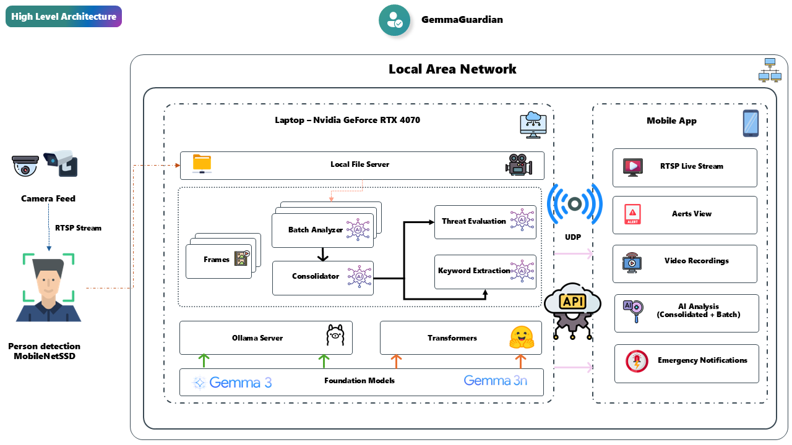
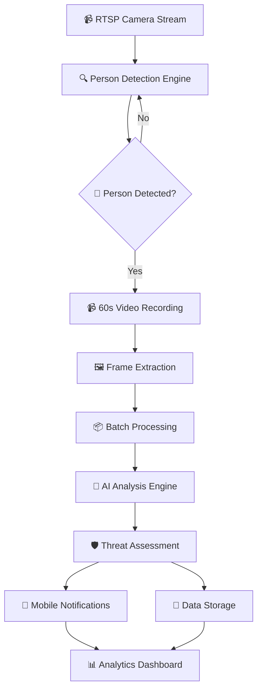

### 🔗 Diagram-to-Implementation Mapping

The official architecture diagram directly corresponds to our implementation:

| **Diagram Component** | **Implementation Module** | **Key Features** |
|----------------------|---------------------------|------------------|
| 📹 **RTSP Input** | `rtsp_stream.py` | Stream monitoring, reconnection, frame buffering |
| 🔍 **Person Detection** | `person_detector.py` | MobileNet SSD, Haar Cascade fallback, confidence filtering |
| 🎥 **Video Recording** | `video_recorder.py` | FFmpeg integration, 60s clips, HD quality |
| 🖼️ **Frame Processing** | `security_monitor.py` | 2s intervals, 1024x1024 resize, batch formation |
| 🧠 **AI Analysis** | `ollama_client.py` / `gemma_transformer_client.py` | Dual-mode processing, batch optimization |
| 🛡️ **Threat Assessment** | `use_cases.py` | Classification, confidence scoring, reporting |
| 📱 **Mobile API** | `security_data_api.py` | REST endpoints, live streaming, notifications |
| 💾 **Data Storage** | `repositories.py` | SQLite operations, file management, archiving |

This direct mapping ensures that the conceptual architecture shown in the diagram is faithfully implemented in the codebase, providing traceability from design to execution.

## 🔧 Core Architecture System Architecture

Comprehensive technical architecture documentation for the GemmaGuardian AI Surveillance System.

## 🎯 System Overview

GemmaGuardian is a sophisticated AI-powered surveillance system that transforms any RTSP camera into an intelligent security monitoring solution. The system combines real-time person detection with advanced AI analysis to provide context-aware threat assessment.

## Official Architecture Diagram



*Figure 1: Complete GemmaGuardian system architecture showing the flow from RTSP input through AI processing to mobile notifications and storage.*

## Core Architecture

### High-Level System Flow



### Component Architecture

```
┌─────────────────────────────────────────────────────────────┐
│                    GemmaGuardian System                         │
├─────────────────────────────────────────────────────────────┤
│                                                             │
│  ┌─────────────────┐    ┌─────────────────┐                 │
│  │  RTSP Stream    │    │ Person Detection│                 │
│  │  Monitor        │    │ Engine          │                 │
│  │                 │    │                 │                 │
│  │ • Stream Reader │    │ • MobileNet SSD │                 │
│  │ • Reconnection  │    │ • Haar Cascade  │                 │
│  │ • Frame Buffer  │    │ • Confidence    │                 │
│  └─────────────────┘    │   Filtering     │                 │
│           │              └─────────────────┘                │
│           └─────────────────────┬───────────────────────────┘
│                                 │
│  ┌─────────────────────────────────────────────────────────┐
│  │              Video Recording Engine                     │
│  │                                                         │
│  │ • FFmpeg Integration     • 60-Second Clips              │
│  │ • High Definition        • Automatic Cleanup            │
│  │ • Motion Triggered       • Storage Management           │
│  └─────────────────────────────────────────────────────────┘
│                                 │
│  ┌─────────────────────────────────────────────────────────┐
│  │              Frame Processing Pipeline                  │
│  │                                                         │
│  │ • 2-Second Intervals     • 1024x1024 Resolution         │
│  │ • 30 Frames Total        • Quality Optimization         │
│  │ • Batch Grouping         • Memory Management            │
│  └─────────────────────────────────────────────────────────┘
│                                 │
│  ┌─────────────────────────────────────────────────────────┐
│  │                 AI Analysis Engine                      │
│  │                                                         │
│  │  ┌───────────────┐           ┌───────────────┐          │
│  │  │ Ollama Mode   │           │Transformer Mode│         │
│  │  │               │           │               │          │
│  │  │• Server-based │           │• Direct GPU   │          │
│  │  │• Gemma 3 4B   │           │• Local Process│          │
│  │  │• Production   │           │• Edge Deploy  │          │
│  │  └───────────────┘           └───────────────┘          │
│  └─────────────────────────────────────────────────────────┘
│                                 │
│  ┌─────────────────────────────────────────────────────────┐
│  │              Security Assessment Engine                 │
│  │                                                         │
│  │ • Threat Classification  • Confidence Scoring           │
│  │ • Keyword Extraction     • Anti-hallucination           │
│  │ • Behavioral Analysis    • Professional Reporting       │
│  └─────────────────────────────────────────────────────────┘
│                                 │
│  ┌─────────────────────────────────────────────────────────┐
│  │                Mobile API Server                        │
│  │                                                         │
│  │ • REST Endpoints        • Live Stream Proxy             │
│  │ • Real-time Status      • Configuration Management      │
│  │ • History Browsing      • Notification System           │
│  └─────────────────────────────────────────────────────────┘
└─────────────────────────────────────────────────────────────┘
```

## 🧠 AI Processing Architecture

### Dual AI Mode Design

#### 🌐 Ollama Mode (Server-Based)
```
┌─────────────────────────────────────────────────┐
│                Ollama Server                    │
├─────────────────────────────────────────────────┤
│                                                 │
│  ┌─────────────────┐    ┌─────────────────┐     │
│  │  Gemma 3 4B     │    │ Gemma 3n e4b    │     │
│  │  Vision Model   │    │ Text Model      │     │
│  │                 │    │                 │     │
│  │ • Image Analysis│    │ • Consolidation │     │
│  │ • Scene Descr.  │    │ • Threat Eval.  │     │
│  │ • Object Detect │    │ • Summarization │     │
│  └─────────────────┘    └─────────────────┘     │
│                                                 │
├─────────────────────────────────────────────────┤
│            Client Application                   │
│                                                 │
│ 1. Send 4 frames → Vision Model                 │
│ 2. Receive descriptions                         │
│ 3. Send batch summary → Text Model              │
│ 4. Receive threat assessment                    │
└─────────────────────────────────────────────────┘
```

#### 🔥 Transformer Mode (Direct Processing)
```
┌─────────────────────────────────────────────────┐
│              Local Processing                   │
├─────────────────────────────────────────────────┤
│                                                 │
│  ┌─────────────────────────────────────────┐    │
│  │        Gemma 3n e2b Model               │    │
│  │                                         │    │
│  │ • Vision + Text Processing Combined     │    │
│  │ • GPU/CPU Optimization                  │    │
│  │ • Memory Management                     │    │
│  │ • Direct PyTorch Inference              │    │
│  │ • Offline Capability                    │    │
│  └─────────────────────────────────────────┘    │
│                                                 │
├─────────────────────────────────────────────────┤
│            Hardware Optimization                │
│                                                 │
│ • CUDA GPU Acceleration                         │
│ • Automatic Memory Management                   │
│ • CPU Fallback Support                          │
│ • Model Caching                                 │
└─────────────────────────────────────────────────┘
```

## 📊 Data Flow Architecture

### Detection to Analysis Pipeline

```
1. RTSP Stream Input
   ↓ [Continuous monitoring]
   
2. Person Detection (MobileNet SSD)
   ↓ [Confidence > 0.5]
   
3. Video Recording Trigger
   ↓ [60-second clip, 1080p]
   
4. Frame Extraction
   ↓ [Every 2 seconds, 30 frames]
   
5. Image Processing
   ↓ [Resize to 1024x1024]
   
6. Batch Formation
   ↓ [Groups of 4 frames]
   
7. AI Analysis (Ollama/Transformer)
   ↓ [Scene description + threat assessment]
   
8. Security Evaluation
   ↓ [Threat level + confidence score]
   
9. Notification & Storage
   ↓ [Mobile alert + database]
   
10. Analytics Dashboard
    [Historical analysis + reporting]
```

### Data Storage Architecture

```
📁 Data Storage Structure
├── 📹 recordings/
│   ├── security_clip_YYYYMMDD_HHMMSS_XXX.mp4
│   └── [Automatic retention: 30 days]
│
├── 🖼️ frames_analyzed/
│   ├── YYYYMMDD_HHMMSS_XXX/
│   │   ├── frame_000.jpg
│   │   └── frame_030.jpg
│   └── [High-resolution evidence]
│
├── 📊 data/
│   ├── security_monitor.db (SQLite)
│   └── security_analyses.json
│
└── 📝 logs/
    ├── security_monitor_YYYY-MM-DD.log
    └── [Rotating logs with retention]
```

## 🔌 API & Integration Architecture

### Mobile App Integration

```
┌─────────────────────────────────────────────────┐
│                Android App                      │
├─────────────────────────────────────────────────┤
│                                                 │
│  ┌─────────────────┐    ┌─────────────────┐     │
│  │  Live Viewer    │    │ Alert Manager   │     │
│  │                 │    │                 │     │
│  │ • RTSP Proxy    │    │ • Push Notifs   │     │
│  │ • Real-time     │    │ • Threat Levels │     │
│  │ • Adaptive      │    │ • History       │     │
│  └─────────────────┘    └─────────────────┘     │
│                                                 │
├─────────────────────────────────────────────────┤
│              REST API Layer                     │
│                                                 │
│ • /api/status           • /api/live-feed        │
│ • /api/recent-analyses  • /api/settings         │
│ • /api/recordings       • /api/threat-history   │
└─────────────────────────────────────────────────┘
                         ║
┌─────────────────────────────────────────────────┐
│            GemmaGuardian Core System                │
│                                                 │
│ • FastAPI Server (Port 8888)                    │
│ • WebSocket Support (Future)                    │ 
│ • JSON Response Format                          │
│ • Error Handling & Logging                      │ 
└─────────────────────────────────────────────────┘
```

## 🏛️ Clean Architecture Implementation

### Layer Structure

```
📁 src/SurveillanceAgent/
├── 🏗️ config/                    # Configuration Management
│   ├── settings.py               # Environment settings
│   └── dependency_injection.py   # DI container
│
├── 📦 modules/                   # Core Application Modules
│   ├── 🎯 domain/                # Business Logic Layer
│   │   ├── entities.py           # Core entities
│   │   ├── repositories.py       # Repository interfaces
│   │   └── services.py          # Domain services
│   │
│   ├── 🔧 infrastructure/        # External Services Layer
│   │   ├── rtsp_stream.py        # RTSP integration
│   │   ├── person_detector.py    # Person detection
│   │   ├── video_recorder.py     # Video recording
│   │   ├── ollama_client.py      # Ollama AI client
│   │   ├── gemma_transformer_client.py # Direct transformer
│   │   └── security_data_api.py  # Mobile API server
│   │
│   ├── 🎪 application/           # Use Cases Layer
│   │   ├── use_cases.py          # Business use cases
│   │   └── security_monitor.py   # Main orchestrator
│   │
│   └── 🔌 interfaces/            # Adapters Layer
│       └── repositories.py       # Repository implementations
│
├── 📊 data/                      # Data Storage
├── 📁 recordings/                # Video Storage
├── 📝 logs/                      # System Logs
├── 🖼️ frames_analyzed/           # Extracted Frames
└── 📋 models/                    # AI Model Files
```

### Dependency Flow

```
┌─────────────────────────────────────────────────┐
│                Main Entry Point                 │
│                   main.py                       │
└─────────────────────┬───────────────────────────┘
                      │
┌─────────────────────▼───────────────────────────┐
│              Application Layer                  │
│                                                 │
│  ┌─────────────────────────────────────────┐    │
│  │         SecurityMonitor                 │    │
│  │         (Orchestrator)                  │    │
│  │                                         │    │
│  │ • Coordinates all components            │    │
│  │ • Manages lifecycle                     │    │
│  │ • Error handling                        │    │
│  └─────────────────────────────────────────┘    │
└─────────────────────┬───────────────────────────┘
                      │
┌─────────────────────▼───────────────────────────┐
│                Domain Layer                     │
│                                                 │
│  ┌─────────────────┐    ┌─────────────────┐     │
│  │   Use Cases     │    │   Entities      │     │
│  │                 │    │                 │     │
│  │ • Detection     │    │ • SecurityEvent │     │
│  │ • Analysis      │    │ • ThreatAssess  │     │
│  │ • Recording     │    │ • VideoClip     │     │
│  └─────────────────┘    └─────────────────┘     │
└─────────────────────┬───────────────────────────┘
                      │
┌─────────────────────▼───────────────────────────┐
│           Infrastructure Layer                  │
│                                                 │
│ ┌─────────────┐ ┌─────────────┐ ┌─────────────┐ │
│ │RTSP Monitor │ │AI Processor │ │Data Storage │ │
│ │             │ │             │ │             │ │
│ │• Camera     │ │• Ollama     │ │• Database   │ │
│ │• Streaming  │ │• Transform  │ │• Files      │ │
│ │• Recording  │ │• Analysis   │ │• API Server │ │
│ └─────────────┘ └─────────────┘ └─────────────┘ │
└─────────────────────────────────────────────────┘
```
---

## 🎯 Quick Architecture Reference

### Key Components
- **Person Detection**: MobileNet SSD + Haar Cascade fallback
- **AI Processing**: Dual mode (Ollama server / Direct transformer)
- **Video Management**: FFmpeg-based 60-second clip recording
- **Mobile Integration**: REST API + Android companion app
- **Data Storage**: SQLite database + file system

### Processing Flow
1. **RTSP monitoring** → 2. **Person detection** → 3. **Video recording** → 4. **Frame extraction** → 5. **AI analysis** → 6. **Threat assessment** → 7. **Notification & storage**

### Performance Metrics
- **Detection**: <100ms per frame
- **Analysis**: 25-60 seconds per 60-second clip
- **Batch Processing**: 75% reduction in API calls
- **Memory Usage**: 2-10GB depending on AI mode

---

**💡 Architecture Principle**: The system prioritizes reliability, performance, and privacy through local processing, clean separation of concerns, and robust error handling.
